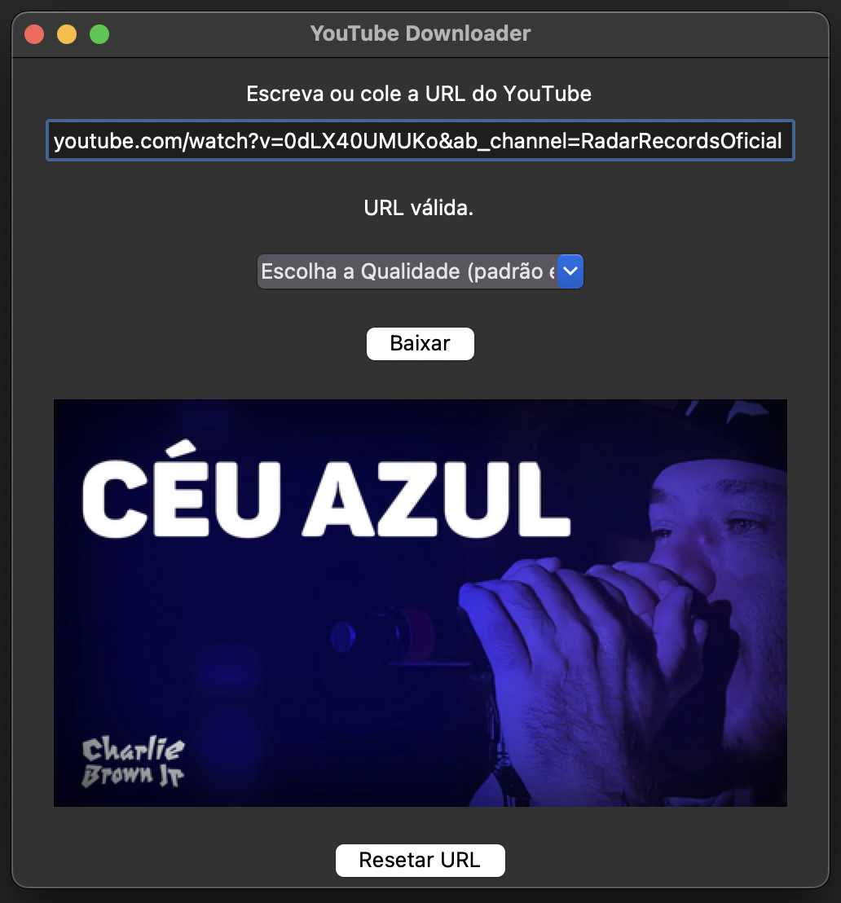
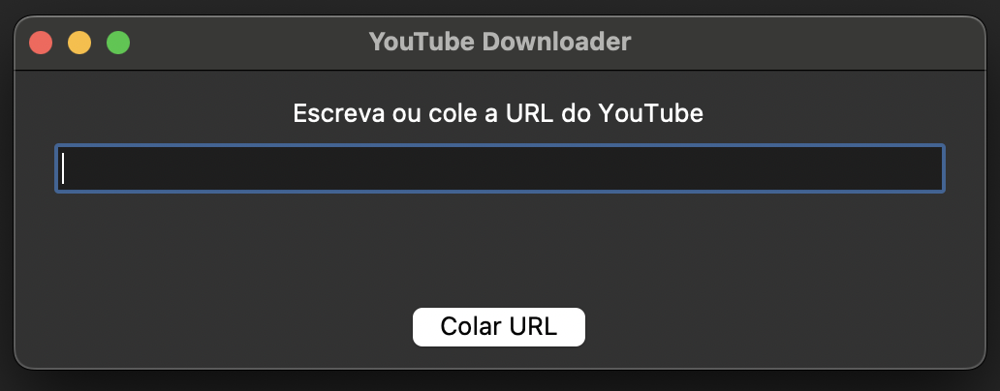
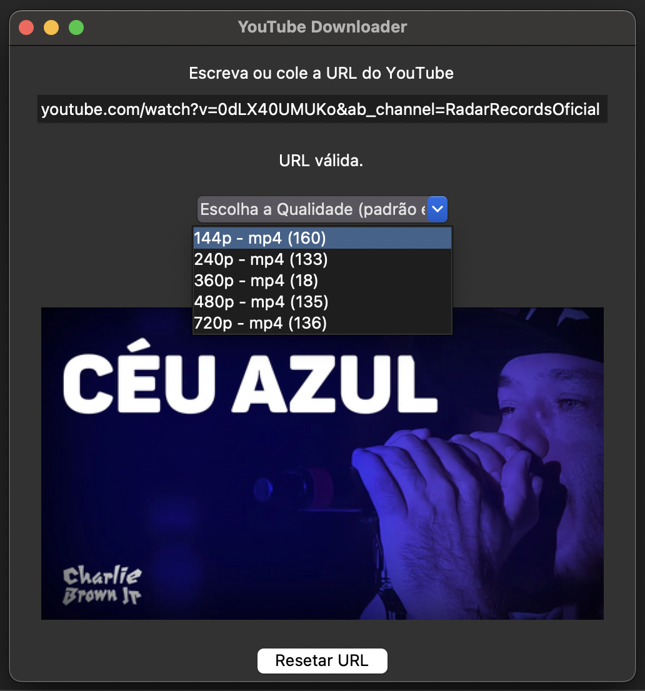
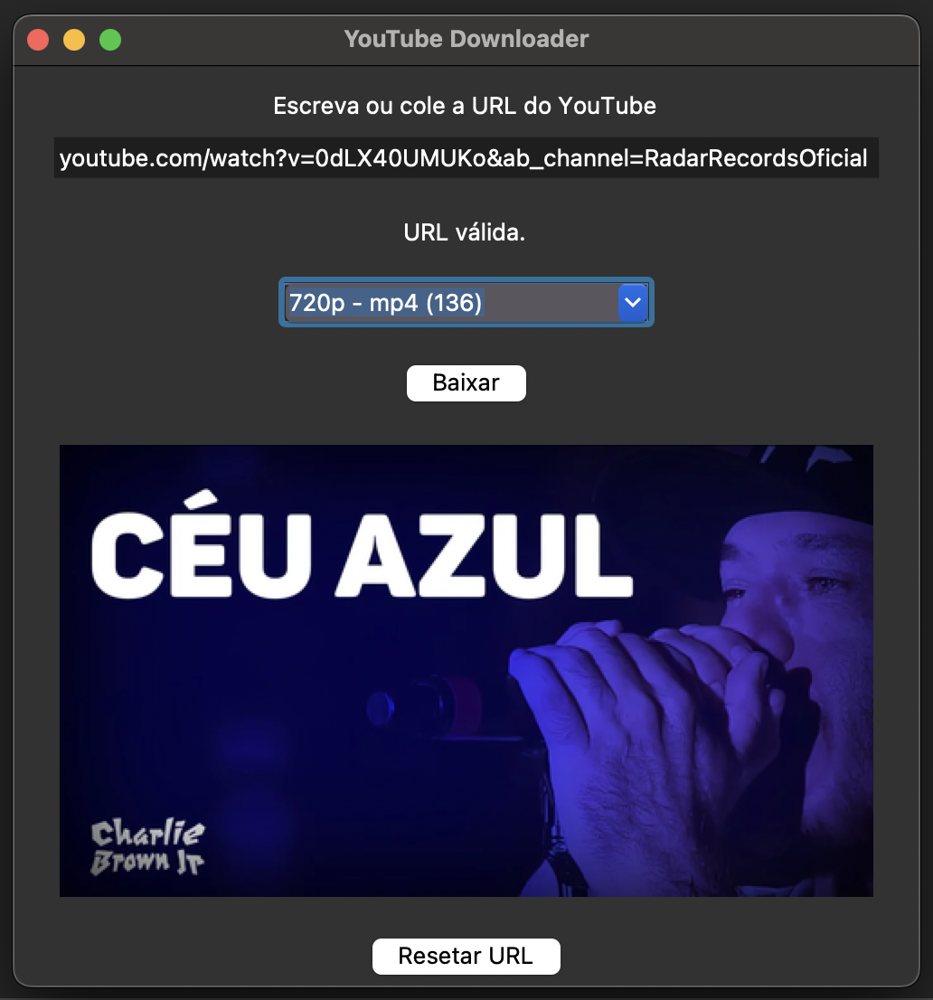

# YouTube Downloader em Python

Este projeto é um baixador de videos do Youtube construído em Python, utilizando a biblioteca **yt-dlp** para baixar vídeos do YouTube. O programa oferece uma interface gráfica amigável desenvolvida com **Tkinter**, onde o usuário pode inserir ou colar uma URL de vídeo do YouTube, selecionar a qualidade de vídeo desejada e realizar o download. É utilizada a biblioteca externa `PIL` para o gerenciamento de imagens.
      



## Funcionalidades

1. **Inserção de URL**: O usuário pode inserir ou colar diretamente uma URL de vídeo do YouTube.
    

      
2. **Verificação de URL**: O programa valida a URL inserida e verifica as qualidades de vídeo disponíveis para download.
3. **Seleção de Qualidade**: O programa exibe a Thumbnail(capa) do vídeo e o usuário pode escolher a resolução desejada dentre as opções disponíveis no video em questão (ex: 480o, 720p etc.).


     

4. **Download de Vídeo**: Após a escolha da qualidade, o vídeo é baixado na pasta local no formato MP4.
5. **Fallback**: Se a qualidade escolhida não estiver disponível, o programa baixa o melhor formato disponível.

## Como Usar

### Requisitos

1. **Instalar as bibliotecas necessárias**:
   - yt-dlp
   - tkinter (integrada ao Python)
   - PIL (Pillow)
   - requests

   Execute o seguinte comando para instalar as dependências:
   
   ```
   pip install yt-dlp Pillow requests
   ```

2. **Baixar ou clonar este repositório**.

### Como Executar

1. Após baixar/clonar o projeto, execute o seguinte comando:
   
   ```
   python youtube_downloader.py
   ```

2. **Inserção de URL**:
   - Insira ou cole uma URL de vídeo do YouTube na caixa de texto da interface e clique no botão "Verificar URL".
   
3. **Seleção de Qualidade**:
   - Se a URL for válida, selecione a qualidade de vídeo desejada a partir da lista de opções fornecidas.
   
4. **Download**:
   - Após selecionar a qualidade, clique em "Baixar" e o vídeo será baixado no formato MP4.
      
   
     
### Mensagens de Erro

- Se ocorrer um erro durante o download, uma mensagem será exibida na interface e um aviso será mostrado. O programa tenta baixar no melhor formato disponível se a qualidade selecionada falhar.

## Observações

- A miniatura do vídeo será exibida após a verificação da URL.
- Se a URL for inválida ou não houver formatos disponíveis, uma mensagem de erro será exibida.
- Todos os vídeos são baixados no formato MP4.
